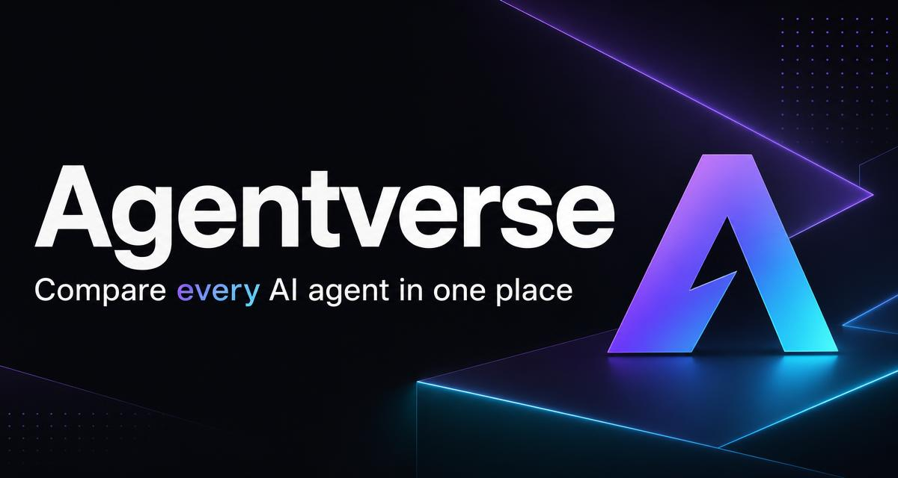

# Agentverse

A modern, accessible web platform for discovering and comparing AI agents. Agentverse helps users find the right AI tools for their needs across categories like chat, coding, design, voice, video, automation, research, and more.

**Live site:** [https://agentverse1.lovable.app](https://agentverse1.lovable.app)



## Features

- **AI Agent Directory** — Browse 60+ agents across categories such as Conversational, Coding, Creative, Business, Research, Automation, Voice, Video, and Design.
- **Side-by-Side Comparison** — Select up to 4 agents and compare their ratings, pricing, categories, tags, and key capabilities in a modal table.
- **Real Brand Logos** — Agent logos are pulled from each agent's domain with automatic fallback to a generated lettermark.
- **Dark / Light Mode** — Toggle between themes with a smooth animated background that adapts to both.
- **3D Hero Section** — An interactive React Three Fiber scene with animated metallic boxes.
- **Accessible UI** — Semantic HTML, ARIA labels, keyboard navigation, and responsive design.
- **Coming Soon Section** — Preview upcoming agents and models.

## Tech Stack

- [Vite](https://vitejs.dev/) — Fast build tooling
- [React](https://react.dev/) — UI library
- [TypeScript](https://www.typescriptlang.org/) — Type-safe development
- [Tailwind CSS](https://tailwindcss.com/) — Utility-first styling
- [shadcn/ui](https://ui.shadcn.com/) — Accessible UI components
- [React Three Fiber](https://docs.pmndrs.io/react-three-fiber/) — 3D hero scene
- [Framer Motion](https://www.framer.com/motion/) — Animations and transitions
- [tsParticles](https://particles.js.org/) — Particle footer background

## Getting Started

### Prerequisites

- Node.js 18+
- npm or bun

### Installation

```bash
# Clone the repository
git clone <YOUR_GIT_URL>

# Navigate into the project
cd agentverse

# Install dependencies
npm install

# Start the development server
npm run dev
```

The dev server runs at `http://localhost:8080`.

### Build for production

```bash
npm run build
```

## Project Structure

```
agentverse/
├── public/                 # Static assets (favicon, OG image, robots)
├── src/
│   ├── assets/             # Logo and generated images
│   ├── components/         # Reusable React components
│   │   ├── agent-logo.tsx      # Dynamic agent logo loader
│   │   ├── comparison-view.tsx # Compare bar and dialog
│   │   └── ui/                 # shadcn/ui and custom UI components
│   ├── hooks/              # Custom React hooks
│   ├── lib/                # Utility functions
│   ├── pages/              # Route-level pages
│   ├── App.tsx             # Main app component
│   ├── index.css           # Tailwind and design tokens
│   └── main.tsx            # Entry point
├── index.html
├── package.json
├── tailwind.config.ts
├── tsconfig.json
└── vite.config.ts
```

## Deployment

This project is built with Lovable. To publish or connect a custom domain:

1. Open the project in [Lovable](https://lovable.dev/projects/abc2d1f7-71a9-4b46-80c9-e52c8a5f12b5).
2. Click **Share → Publish** to deploy.
3. For a custom domain, go to **Project → Settings → Domains**.

Read more in the [Lovable docs](https://docs.lovable.dev/).

## License

MIT
